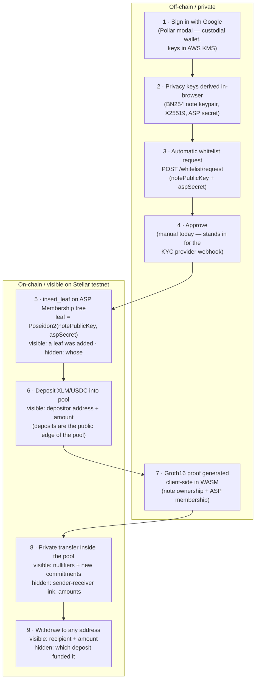

# Pollar Private Payments

**Compliant private payments on Stellar with consumer UX — sign in with Google, no browser extension, no seed phrase.**

Built for the **Stellar Hacks: Real-World ZK** hackathon (DoraHacks × Stellar Development Foundation).

> [!WARNING]
> Unaudited. Testnet only. This is a fork of a work-in-progress research project ([NethermindEth/stellar-private-payments](https://github.com/NethermindEth/stellar-private-payments)) plus hackathon-grade additions. Do not use with real assets.

---

## The problem

Every Stellar payment is public: amount, sender, and receiver are permanently visible to anyone. That rules Stellar out for payroll, B2B settlement, and any consumer payment where you wouldn't post your bank statement online.

Existing on-chain privacy solutions have two adoption killers:

1. **Crypto-native UX** — they require an extension wallet (Freighter), seed phrases, and manual message signing. A mainstream remittance or payroll user won't do any of that.
2. **The mixer problem** — without compliance controls, unscreened privacy pools are unusable by regulated businesses and end up delisted or sanctioned.

## The solution

A **privacy pool with a compliance gate**, wrapped in **Web2 onboarding**:

- **Privacy pool (ZK)**: users deposit XLM or USDC into a Soroban pool contract and later transfer/withdraw privately. In plain terms: a deposit creates a **commitment** (a hash hiding the amount and owner) in the pool's Merkle tree. To spend, the user proves *in zero knowledge* that they own some unspent commitment — without revealing which one — and publishes a **nullifier** (a one-way tag that prevents double-spending without linking back to the deposit). Observers see that *someone* moved *some* funds inside the pool, but not who, to whom, or how much of the shielded balance.
- **Compliance gate (ASP)**: an Association Set Provider maintains an on-chain Merkle tree of approved users. The user's **ASP membership proof is part of the same Groth16 proof** that the pool verifies on-chain — a prover who isn't in the approved set cannot produce a valid proof, so the contract rejects the transaction. Privacy for users, screening for the operator.
- **Consumer onboarding (Pollar)**: [Pollar](https://pollar.xyz) provides custodial Stellar wallets behind Google/email login (keys in AWS KMS, fees sponsored). Combined with our automated whitelist service — designed to hang off a KYC provider webhook — the full flow is: *sign in with Google → get verified → pay privately*. No extension, no seed phrase, no XLM needed for gas.

**The ZK is load-bearing**: every `transact` call on the pool contract requires a Groth16 proof verified on-chain by [`CircomGroth16Verifier::verify`](contracts/circom-groth16-verifier/src/lib.rs) ([`CCA5SMNQ…`](https://stellar.expert/explorer/testnet/contract/CCA5SMNQGZN5CWWSRJITSWLEFE6XXGHEQUXSGU6KUFBQ4NC4OKKWYT26) on testnet). The public inputs bind the pool Merkle root, the nullifiers, the output commitments, and the **ASP membership root** (`verify_proof` in [`contracts/pool/src/pool.rs`](contracts/pool/src/pool.rs)); the proof is generated client-side in WASM from Circom circuits ([`circuits/src/policyTransaction.circom`](circuits/src/policyTransaction.circom)). No valid proof → no state change.

## Flow



## Attribution

**Built on [NethermindEth/stellar-private-payments](https://github.com/NethermindEth/stellar-private-payments)** — a reference implementation of privacy pools for Stellar by Nethermind. All of the cryptography and on-chain machinery is theirs; our work is the onboarding, compliance automation, and product layer on top.

| From the original project | What we built |
|---|---|
| Circom circuits (`circuits/` — policy transaction, membership/non-membership) | **Pollar integration** (`app/js/wallet-pollar*.js`, `app/js/pollar-modal.js`): Google/email OTP custodial onboarding through the official `@pollar/react` login modal, provider-dispatch wallet layer, custodial signing with a connect-time capability probe, custodial USDC top-up payments |
| Soroban contracts (`contracts/` — pool, Groth16 verifier, ASP membership & non-membership, public key registry) | **Whitelist server** (`server/`): request → approve → Poseidon2 leaf derivation → on-chain `insert_leaf`; Express + Rust CLI (`server/leaf-cli`, links the repo's own `prover` crate — no crypto reimplemented) |
| Groth16 verifier with the ceremony verification key embedded | **`asp-leaf-cli` tooling**: `check-membership` (headless reproduction of the app's ASP precondition, runnable against a copy of a user's browser DB), `e2e-seed`, `e2e-deposit` (full headless deposit through the real SDK pipeline) |
| Frontend base (Rust/WASM + vanilla JS, Freighter integration) | **USDC pool**: a second pool sharing the same ASP — one whitelist gates both pools |
| Rust SDK (`sdk/` — prover, state, stellar, pool orchestration) | **Auto-whitelist UX**: Pollar users are registered with the ASP automatically after key derivation, with status polling ("pending → approved") in the UI |
| Deploy scripts, docs, tests | **Fixes** (relevant upstream, documented in [`WHITELIST.md`](WHITELIST.md)): per-contract scoping of `asp_membership_leaves` (SQLite migration `002` — the original global `PRIMARY KEY (leaf_index)` silently dropped leaves after a contract redeploy, permanently breaking membership checks); `Cache-Control: no-cache` for `trunk serve` (stale-WASM cache bug) |

## What's real vs. mocked

Full detail with citations in [`POLLAR_INTEGRATION.md`](POLLAR_INTEGRATION.md). Summary:

| Piece | Status |
|---|---|
| ZK pipeline: client-side Groth16 proving in WASM, on-chain verification, ASP membership constraint | **Real** — from the upstream project, exercised end-to-end on testnet (tx hashes below) |
| Pollar login (Google OAuth / email OTP via the official Pollar modal), custodial wallet creation, session handling | **Real** |
| Whitelist server → Poseidon2 leaf → on-chain `insert_leaf` by the ASP admin | **Real** — inserts verified byte-for-byte against on-chain `LeafAdded` events |
| Custodial USDC top-up (`runTx('payment')`, KMS-signed, fee-sponsored) before bridge-mode USDC deposits | **Real** — Pollar's core payment API |
| Approve step | **Manual today** (`curl POST /whitelist/approve`) — it stands in for the KYC provider webhook (e.g. Bridge) that would call the same endpoint in production. Roadmap, not built. |
| Privacy key derivation | **Workaround (declared)**: Pollar exposes no `signMessage`, so keys derive from browser-generated entropy persisted per Pollar identity — not re-derivable from the wallet; clearing site data loses them. Roadmap: `signMessage` in Pollar. |
| Pool transaction signing for Pollar users | **Two modes, decided by a runtime probe.** If Pollar's backend accepts custodial auth-entry signing for the pool contract (per-app allowlist), everything is signed with the user's KMS key (real custodial signing). Otherwise the app falls back to a **declared bridge mode**: a local browser keypair (friendbot-funded, marked `// BRIDGE MODE` in code) signs pool transactions, while the Pollar wallet remains the user-facing identity and source of funds. TODO(user): state which mode the demo video runs in (the UI shows a "Pollar custodial signing enabled (KMS)" toast when custodial). |
| Freighter flow (original) | **Real and untouched** — available via ⌥-click on Login |

## Deployed contracts (Stellar testnet)

| Contract | Address |
|---|---|
| Pool — XLM (native) | [`CCK7YAPUWGKTLZQF6SNA2K4GWBB4W44G7EBFVXEDQOJRVOHYPSHQKBM7`](https://stellar.expert/explorer/testnet/contract/CCK7YAPUWGKTLZQF6SNA2K4GWBB4W44G7EBFVXEDQOJRVOHYPSHQKBM7) |
| Pool — USDC (testnet USDC, issuer `GBBD47IF…LFLA5`) | [`CDW6JF2QNZSHTBGASJ5XCPVVSLVYVTJUDONMUCU2KKZHEODT6YW3F73C`](https://stellar.expert/explorer/testnet/contract/CDW6JF2QNZSHTBGASJ5XCPVVSLVYVTJUDONMUCU2KKZHEODT6YW3F73C) |
| Groth16 Verifier (ceremony VK embedded in the WASM) | [`CCA5SMNQGZN5CWWSRJITSWLEFE6XXGHEQUXSGU6KUFBQ4NC4OKKWYT26`](https://stellar.expert/explorer/testnet/contract/CCA5SMNQGZN5CWWSRJITSWLEFE6XXGHEQUXSGU6KUFBQ4NC4OKKWYT26) |
| ASP Membership (shared by both pools) | [`CAM4ED3KQLME7UY7KCLMZ2UJRUWIIIV4X5HC5Q5I4ZXQQW7VOHZ34LXU`](https://stellar.expert/explorer/testnet/contract/CAM4ED3KQLME7UY7KCLMZ2UJRUWIIIV4X5HC5Q5I4ZXQQW7VOHZ34LXU) |
| ASP Non-Membership | [`CCOY5SZELQHFIKARPDUVYYFB6SX2ZOOS4GKHHJWALNWEBDEVUGQSIWX2`](https://stellar.expert/explorer/testnet/contract/CCOY5SZELQHFIKARPDUVYYFB6SX2ZOOS4GKHHJWALNWEBDEVUGQSIWX2) |
| Public Key Registry | [`CBPMYVUXDSQEG3GTABGLSBPMP63JUSY22RFAO5VZEMCPSVBHC3B76ZCJ`](https://stellar.expert/explorer/testnet/contract/CBPMYVUXDSQEG3GTABGLSBPMP63JUSY22RFAO5VZEMCPSVBHC3B76ZCJ) |
| Pool — USDC (first iteration with a throwaway test issuer; superseded by the pool above, now disabled in config) | [`CBUB4XICKADWNTRG3OYXYQPJ7PSJKARDYXSHAPMJCRBKJJCOCSO44FWD`](https://stellar.expert/explorer/testnet/contract/CBUB4XICKADWNTRG3OYXYQPJ7PSJKARDYXSHAPMJCRBKJJCOCSO44FWD) |

**End-to-end transactions** (full ZK pipeline: sync → prove → sign → submit → on-chain Groth16 verification):

| What | Tx |
|---|---|
| 1 XLM private deposit | [`f5ec6549…224e3f`](https://stellar.expert/explorer/testnet/tx/f5ec65499848b4e3f7e5f5f255168f48270a5a50312a302cc5ddec1cec224e3f) |
| 1 USDC private deposit — same whitelist, no re-approval (on the first-iteration USDC pool) | [`9e008c11…630fcd`](https://stellar.expert/explorer/testnet/tx/9e008c1166fc57e0884fb06d818e9395620f1a35247d553f464b12fabc630fcd) |
| ASP whitelist `insert_leaf` (e2e user) | [`9458ac14…3664`](https://stellar.expert/explorer/testnet/tx/9458ac14ccb7974edc95a7ef650cafb16dfd7cb44e0215ba879d5044df0c3664) |
| ASP whitelist `insert_leaf` (Pollar Google-login user) | [`e8de669b…e18b`](https://stellar.expert/explorer/testnet/tx/e8de669bb39c0981621fb863a1f57233fa000a4b066ae3473d2fee0fb816e18b) |

TODO(user): add the tx hash of the UI deposit shown in the demo video.

## Run locally

Prerequisites: Rust (version pinned in `rust-toolchain.toml`, with targets `wasm32v1-none` and `wasm32-unknown-unknown`), Node.js 22+, [stellar-cli](https://developers.stellar.org/docs/tools/cli), [trunk](https://trunkrs.dev) (installed by `make install`).

macOS-specific (details in [`EXPLORATION.md`](EXPLORATION.md)): `sqlite-wasm-rs` needs a wasm-capable clang — `brew install llvm`, then export `CC_wasm32_unknown_unknown=/opt/homebrew/opt/llvm/bin/clang` and `AR_wasm32_unknown_unknown=/opt/homebrew/opt/llvm/bin/llvm-ar`. `deploy.sh` needs bash ≥ 4 (`brew install bash`).

**1. Frontend** — contracts are already deployed on testnet (`deployments/testnet/deployments.json` is committed); to deploy your own set, use `deployments/scripts/deploy.sh`:

```bash
make install                       # npm deps + trunk
cargo build -p circuits --release  # circuit artifacts (release profile)
make serve                         # builds the WASM and serves http://localhost:8000
```

The Pollar publishable API key is embedded in `app/js/wallet-pollar.js` (`pub_testnet_…`; publishable keys are safe in frontend code) and its allowed origin is `http://localhost:8000`.

**2. Whitelist server**:

```bash
cargo build -p asp-leaf-cli --release   # leaf-derivation CLI (links the repo's prover crate)
cd server
npm install
cp .env.example .env                    # defaults work if your stellar-cli has the ASP admin identity
node index.js                           # http://localhost:4000
```

Note: on-chain `insert_leaf` requires the ASP admin key. For a fresh deployment, the deployer identity used in `deploy.sh` is the admin; set it in `server/.env`.

**3. The flow**: open `http://localhost:8000` → **Login** → continue with Google or email (Pollar modal) → onboarding runs automatically and requests whitelisting (UI shows "pending") → approve it:

```bash
curl -s localhost:4000/whitelist/list                      # find the pending id
curl -X POST localhost:4000/whitelist/approve \
  -H 'Content-Type: application/json' -d '{"id":"<ID>"}'   # inserts the leaf on-chain
```

→ the UI flips to "approved" → deposit XLM or USDC privately. The original Freighter flow is available via **⌥-click** on Login.

## Licenses

- Workspace: **Apache-2.0** ([`LICENSE`](LICENSE)) — unmodified from upstream.
- Circuits: **LGPLv3/GPL** ([`circuits/LICENSE`](circuits/LICENSE), [`circuits/COPYING`](circuits/COPYING)) — unmodified from upstream; the app serves the circuits source bundle for LGPL compliance, exactly as upstream does.
- Distribution notices: [`deployments/legal/`](deployments/legal/) — unmodified from upstream.

All upstream license and notice files verified intact against the fork base commit (`8556aab`).
