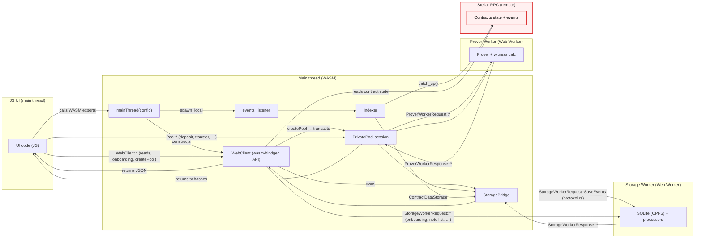

# App Architecture

This document describes how the application manages local state, including persistent storage and on-chain data.

## Overview

**Core vs platforms**

Core application logic is implemented in Rust `sdk/` crates which define sync and async primitives and building blocks.
Platforms `app/crates/platforms` (`web`, in the future - `cli`, `mcp` etc) provide compilation target specific dependencies, setup runtime (asynchronous/threaded), ui interaction protocol (e.g. FFI/http), order of operations.

Other directories in `app` directory mostly define interfaces for the `web` platform but probably can be restructured in the future to include other platforms interfaces as well.

**Storage:**

Local storage is implemented upon SQLite (`sdk/state/src/storage.rs`) with the schema `sdk/state/src/schema.sql` to have a unified storage across different platforms allowing future data syncs across platforms.

## Web platform (WASM + Web Workers)

The `web` platform runs Rust application logic in the browser via WASM, with heavy and/or blocking work offloaded to Web Workers.

### Components

The WASM layer exposes two JS handles with different scope:

| Handle | Scope | Examples |
|--------|-------|----------|
| **`WebClient`** | Account and deployment (all pools) | `getUserNotes`, `contractConfig`, onboarding, `createPool` |
| **`Pool`** (`PrivatePool`) | One pool contract + user session | `deposit`, `transfer`, `withdraw`, `transact`, `disclose` |

`WebClient` is the long-lived entry point; `Pool` is created per active pool when the user transacts.

**JS UI (main thread)**

The UI is written in JavaScript and calls into the WASM bundle. It does not communicate with workers directly.

**Main thread (WASM)**

- Entry point is `mainThread(config)` (WASM export).
- Initializes logging / panic hooks, constructs `WebClient`, and starts the background events listener (`events_listener`).

**Indexer (SDK + web platform)**

- The indexer is generic over a storage backend (`Indexer<S: ContractDataStorage>`).
- On web, the storage backend is **`StorageBridge`**, which implements `ContractDataStorage` (and the SDK `Storage` trait) by forwarding calls to the Storage Worker.
- `events_listener` (in `events.rs`) owns the long-running indexer loop: it constructs `Indexer::init(...)`, calls `catch_up()` on an interval, and handles bootnode handoff when the wallet RPC has a retention gap.
- `WebClient` does **not** implement `ContractDataStorage`; it holds a `StorageBridge` and passes clones of it to the listener and to `PrivatePool`.

**`WebClient` (WASM, wasm-bindgen API)**

- Long-lived handle constructed by `mainThread(config)`; exposed to JS as `webClient`.
- Spawns both workers and performs request/response routing internally; JS never constructs or sends worker protocol messages.
- Implements the worker communication protocol defined in `protocol.rs`.
- **Account- and deployment-wide operations** (not tied to a single active pool session):
  - Onboarding and key derivation (`deriveAndSaveUserKeys`, `getUserKeys`, disclaimer, bootnode config).
  - Cross-pool storage reads via `StorageBridge` (`getUserNotes`, `getRecentPublicKeys`, `getRecentPoolActivity`).
  - Chain/config reads (`contractConfig`, `allContractsData`, `aspState`, `registerPublicKeys`).
  - Selective-disclosure verification without a pool session (`verifySelectiveDisclosure`).
- Creates per-pool transact sessions via `createPool({ poolContract, networkPassphrase, userAddress })`.

**`Pool` / `PrivatePool` (WASM, wasm-bindgen API)**

- Per-pool, per-user session returned by `WebClient.createPool`: SDK `PrivatePool<StorageBridge>` with RPC client, state fetcher, shared `StorageBridge`, `ProverBridge`, and `WalletSigner`.
- **Pool-scoped operations only** — JS holds the handle in app state (`createAppPool` / `closeAppPool`) until wallet disconnect or account switch.
- WASM exports: `estimate`, `deposit`, `transfer`, `withdraw`, `transact`, `disclose`, `verifyDisclosure`, `initialize`, `close`.
- Proving, Freighter signing, and submit run inside this session; returns tx hashes to JS.

The SDK `PrivatePool` type (native / blocking) also defines pool-scoped helpers such as `balance`, `notes`, `spendable_notes`, and `sync`. Those are **not** exported on the web `Pool` handle: the UI reads notes across pools through `WebClient.getUserNotes`, and background sync is owned by `events_listener` (see below), not by `pool.sync()` from JS.

**`StorageBridge` (WASM main thread)**

- Typed async bridge to the Storage Worker (`StorageWorkerRequest` / `StorageWorkerResponse`).
- Used by the indexer, `PrivatePool`, and ad-hoc `WebClient` storage reads/writes.

**Storage Worker (Web Worker)**

- Owns local persistent state: SQLite via OPFS-backed VFS (browser storage).
- Performs local “logic operations”: saving raw events, processing events, scanning/decrypting notes, and maintaining derived state.
- Designed to stay responsive by processing in small chunks and yielding between batches.

**Prover Worker (Web Worker)**

- Runs long/blocking proving so it cannot block the Storage Worker’s background processing or other app requests from the main thread.
- Does not persist any user state; it loads/caches proving artifacts in memory and returns proof results.

### Worker protocol and isolation

The Rust `web` platform crate owns worker spawning and communication. Worker messages are strongly typed and serialized using enums in `protocol.rs` (e.g. `StorageWorkerRequest/Response`, `ProverWorkerRequest/Response`). This protocol is intentionally not exposed to JS.

### Data flow (high level)

**Keypair Derivation:**

Keys are derived deterministically from Freighter wallet signatures:
1. User signs the message defined by `KEY_DERIVATION_MESSAGE` from `sdk/prover/src/encryption.rs`
2. The app derives the BN254 note identity keypair and the X25519 encryption keypair from that single signature using separate domain-separated hashes

**When are signatures prompted?**

At the user onboarding to allow to scan for notes addressed to the user. The derived keys are stored permanently.

### Public Key Store

Maintains an address book of registered public keys in the pool contract for sending private transfers.

## Recovery Scenarios

### Clearing Browser Data

All stored data is lost. On next load:
1. Full sync from RPC (limited by RPC retention window, typically [7 days](https://developers.stellar.org/docs/data/apis/rpc)).
2. Merkle trees rebuilt from synced events.
3. User must re-authenticate for keypair derivation.
4. Note scanning rediscovers received notes.
5. If events are older than retention window, they cannot be recovered.

### Account Switch

If the keys derivation is required, a user will be asked for that. From that moment on, this new account is as well used to scan new notes in the background events processing.
